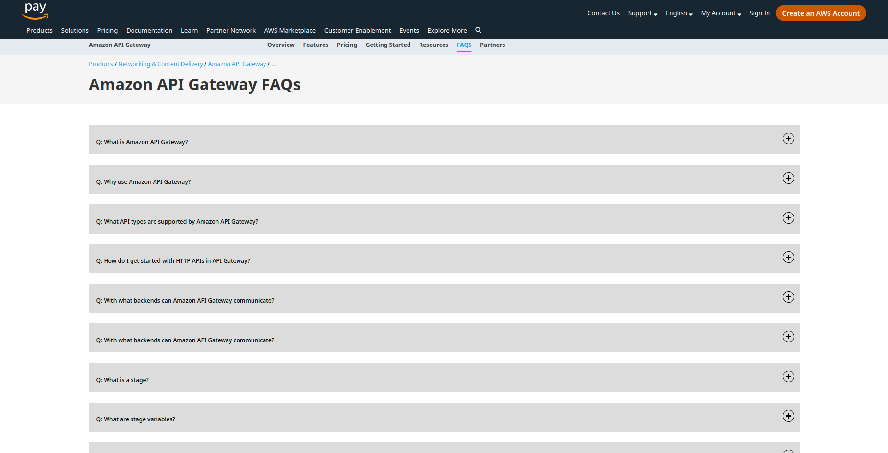

# FAQs Page

> By David Ondiege

Frequently Asked Questions is a web interface that displays most questions asked by individuals to an organisation in need of finding more information about its products or services provided. 
This section saves a user a great deal of time by providing readily available answers to their clients or potential clients.

## Built With

- HTML
- CSS
- JavaScript
- JSON Server

## Description

FAQs Page is a summary of potentialy asked questionsby the general public to an organisation and readily provides answers and relevent guidelines.
This page is essential to any organisation's website and should have a regular update polict to present the most recent pieces of information.

## Screenshots

## Live Demo Link

[FAQs Page](https://david-commit.github.io/FAQ-page/)